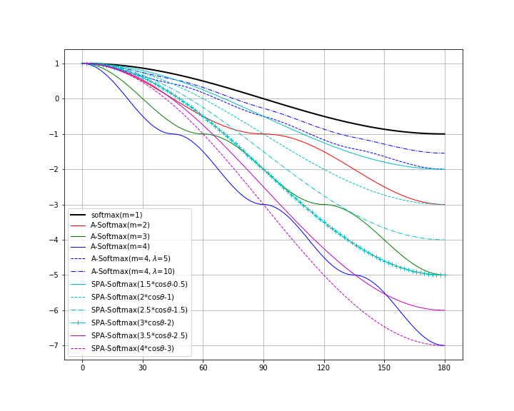

# Sigmoid-Penalized Angular Softmax (SPA-Softmax) Loss for metric learning

!!! The code has not been tested yet!

_SPA-Softmax_ is a modified version of _A-Softmax_ in [Sphereface](https://arxiv.org/abs/1704.08063) (or its previous version: _Largin-margin Softmax_ in [Large-Margin Softmax Loss for Convolutional Neural Networks](https://arxiv.org/abs/1612.02295).
The diffences between the two are as follows:

(This figure was ploted by script: [plot_A_softmax_function.py](./tools/plot_A_softmax_function.py)).